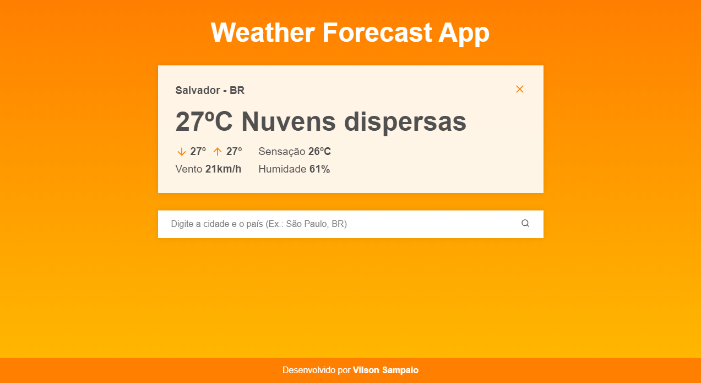
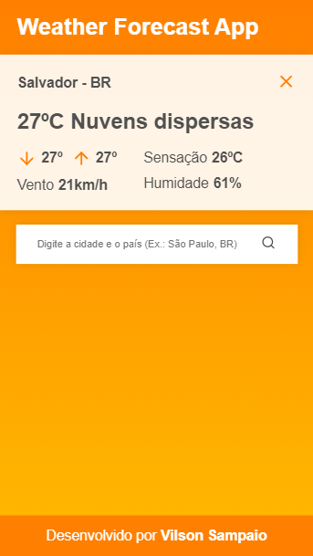

<h1 align="center">
  ⛅ Weather Forecast App
</h1>

  
   
  

  

  

  <a href="#-sobre-o-projeto">Sobre o projeto</a>&nbsp;&nbsp;&nbsp;|&nbsp;&nbsp;&nbsp;
  <a href="#-tecnologias">Tecnologias</a>&nbsp;&nbsp;&nbsp;|&nbsp;&nbsp;&nbsp;
  <a href="#-funcionalidades">Como instalar</a>&nbsp;&nbsp;&nbsp;|&nbsp;&nbsp;&nbsp;
  <a href="#-projeto-final">Projeto final</a>

 

    

## 💻 Sobre o projeto

Aplicação simples feita em ReactJS que, por meio da API do Open Weather, busca a previsão do tempo de uma cidade.

## 🚀 Tecnologias

Esse projeto foi desenvolvido com as seguintes tecnologias:

- [ReactJS](https://reactjs.org/)
- [React Hooks](https://reactjs.org/docs/hooks-intro.html) (useState, useEffect, useRef, useContext)
- [React Icons](https://github.com/react-icons/react-icons)
- [JavaScript](https://developer.mozilla.org/pt-BR/docs/Web/JavaScript)
- [API do OpenWeather](https://openweathermap.org/api)
- [CSS3](https://developer.mozilla.org/pt-BR/docs/Web/CSS)

## 💾 Como instalar

1. Primeiro, é necessário que tenha instalado em seu computador o [NodeJS](https://nodejs.org/en/docs/) e o [Yarn](https://yarnpkg.com/getting-started). Após a instalação dos mesmos, clone esse repositório com o seguinte comando no terminal:

`git clone https://github.com/vilsonsampaio/weather-forecast-app`

2. Navegue para o diretório criado através do clone feito:

`cd weather-forecast-app`

3. Dentro da pasta da aplicação, instale as dependências necessárias usando:

`yarn` ou `yarn add`

4. Na sua IDE, abra a pasta `src/`, em seguida `components/`, `Input/`, e abra o arquivo `index.js`. Dentro do index, procure pela constante de nome `APIkey` e insira ali a chave da API obtida por meio do cadastro no site da [Open Weather](https://openweathermap.org/home/sign_in).

5. Tudo pronto? Agora é só rodar a aplicação:

`yarn start`

## 🌐 Projeto final

### 🖥 Desktop

### 📱 Mobile

---

Feito com 🧡 <a href="https://www.linkedin.com/in/vilsonsampaio/">Vilson Sampaio</a>

